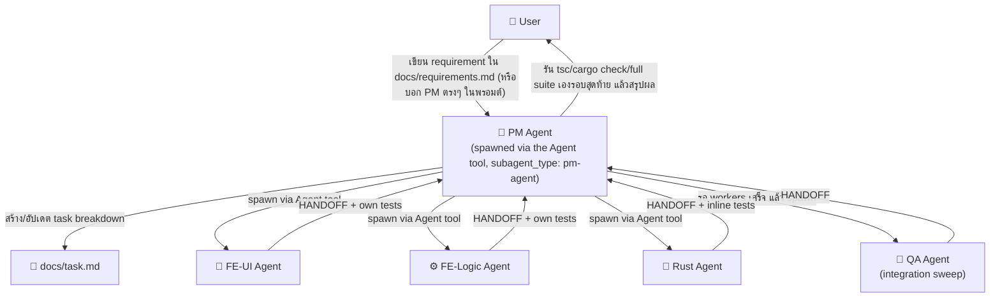
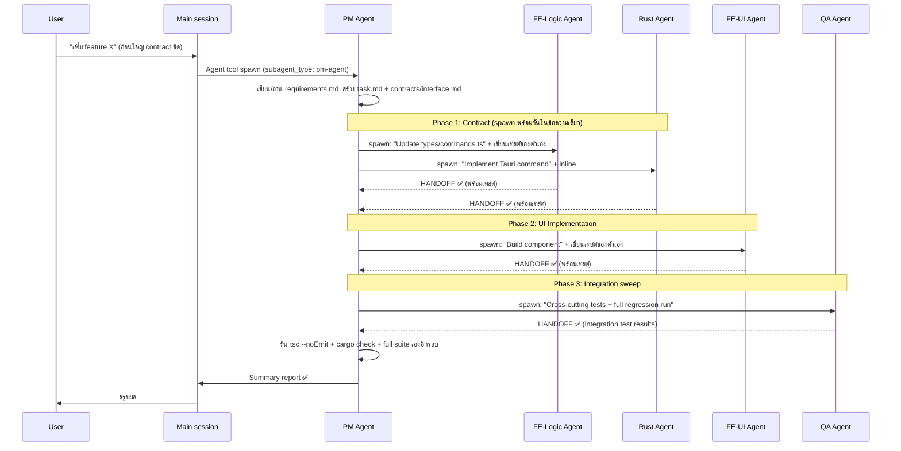

# Multi-Agent Orchestration Design for Claude Code

> **🔄 Redesigned 2026-08-17.** The original version of this doc (written early in
> the project, ~2026-03) assumed a CLI mechanism (`claude --profile`, a bash
> orchestrator spawning `claude` processes) that doesn't exist in the harness
> this project is actually developed in. The pipeline itself was real and was
> used successfully twice (Feature 1: Data Upload Page redesign, Feature 3:
> Predictive Model Rust port — see `docs/task.md`), but then sat completely
> unused for 3+ months because nothing ever prompted anyone to reach for it —
> almost all real work here is small, iterative, cross-cutting fixes done
> directly in the main session, which this pipeline is a poor fit for. This
> revision (a) fixes the mechanism to match what this harness actually
> supports, (b) states explicitly when to use this vs. not, and (c) fixes a
> coordination gap that bit the one time this was used for real (see §"Lesson
> from Feature 1/3" below).

## ปัญหา / โจทย์
โปรเจค Tauri + React ถูก build มาระดับหนึ่งแล้ว ต้องการระบบที่:
1. PM Agent อ่าน requirement ของ feature ที่กำลังจะทำ
2. PM Agent แตก task แล้ว spawn worker agents (FE-UI, FE-Logic, Rust, QA) ผ่าน Claude Code
3. แต่ละ agent ทำงานใน **zone ของตัวเอง** ไม่ข้ามเขต (ยกเว้นเทสต์ของโค้ดตัวเอง — ดู §2)

---

## เมื่อไหร่ควรใช้ pipeline นี้ — และเมื่อไหร่ไม่ควร

**ใช้เมื่อ** งานเข้าเกณฑ์ทั้งหมดนี้ (ตรงกับ Feature 1/3 ที่เคยสำเร็จมาแล้ว):
- เป็น feature ก้อนใหญ่ ไม่ใช่ bug fix/UI tweak จุดเดียว
- มี contract ระหว่าง Rust ↔ TypeScript ที่นิยามได้ชัดเจนตั้งแต่ต้น (Tauri command ใหม่ + shape ของมัน)
- แยกเป็น phase ได้เป็นธรรมชาติ (contract → backend → frontend → test) โดยแต่ละ phase ไม่ต้องย้อนกลับไปแก้ phase ก่อนหน้าบ่อยๆ
- ผู้ใช้พร้อมเขียน/อนุมัติ requirement เต็มรูปแบบไว้ล่วงหน้า ไม่ต้อง iterate ทีละจุดกับผลลัพธ์ระหว่างทาง

**อย่าใช้ (ทำตรงในเซสชันหลักแทน — แบบที่ทำสำเร็จมาตลอด 3 เดือนหลัง) เมื่อ**:
- เป็น bug report สั้นๆ หรือขอปรับ UI ทีละจุด (ทาง user มักส่ง screenshot + คำอธิบายสั้นๆ)
- ต้อง "confirm before implementing" — โชว์แนวทางให้ผู้ใช้ดูก่อนแล้วค่อยแก้จริง (เป็น loop ที่ agent แยกเซสชันกันทำได้ไม่ดี เพราะ handoff แต่ละรอบมี latency)
- การแก้ธรรมชาติของมันข้ามหลายโซนพร้อมกันในไฟล์เดียว/รอบเดียว (เช่น เพิ่ม prop ใหม่ที่ต้องแก้ `types.ts` + `ChartTypes.ts` + component + เทสต์ พร้อมกันเพื่อความถูกต้อง) — บังคับแยกเป็น agent คนละโซนจะเพิ่ม overhead โดยไม่ได้ประโยชน์
- ต้องอาศัยการเห็นภาพรวมทั้ง component/ทั้งไฟล์เพื่อ "recheck existing patterns" ก่อนถือว่าเสร็จ (กฎมาตรฐานของโปรเจกต์นี้) — agent ที่เห็นแค่ zone ตัวเองจับ regression แบบนี้ไม่ได้

Rule of thumb: ถ้าลังเลว่าจะ spawn PM-agent ดีไหม แปลว่าไม่ควร — งานที่เข้าเกณฑ์จริงจะชัดเจนในตัวมันเอง (feature ใหม่ทั้งก้อน มี spec ชัด ไม่ต้อง iterate)

### Lesson from Feature 1/3 (ทำไม §2 ผ่อน zone ownership ในรอบนี้)

ตอนทำ Feature 1 จริง `fe-logic-agent` เปลี่ยน signature ของ `apply_mapping`
(Rust) กลางทาง — ทำให้ `csv_tests.rs` (เทสต์ที่เขียนไว้ก่อนหน้าโดยรอบอื่น)
คอมไพล์ไม่ผ่าน ผลคือถูก flag ไว้ท้าย `docs/task.md` ว่า "out of scope for
Feature 3" แล้วปล่อยพังค้างไว้ — ไม่มี agent ตัวไหนอยู่ในตำแหน่งที่เห็นทั้ง
โค้ดที่เปลี่ยนและเทสต์ที่พังพร้อมกัน เพราะ zone ownership เดิมตัดขาด
`src/__tests__/`/`src-tauri/tests/` ออกจาก worker ทุกตัว ยกให้ qa-agent เป็น
เจ้าของเทสต์ทั้งหมดแต่เพียงผู้เดียว — qa-agent เองก็ไม่เคยถูกเรียกจริง
หลัง Feature 1/3 เลย (งานที่เหลือของโปรเจกต์ทำ test เองในเซสชันหลักแทน
ตามกฎ "write tests with every change" ที่กลายเป็นนิสัยมาตรฐานของ
โปรเจกต์นี้อยู่แล้ว) — รอบนี้เลยแก้ให้ worker แต่ละตัวเขียนเทสต์ของโค้ด
ที่ตัวเองเพิ่งแก้ไปเลยในตัว (เห็นทั้งสองด้านพร้อมกัน ตรงตามนิสัยจริงของ
โปรเจกต์) ส่วน qa-agent เปลี่ยนบทบาทเป็น cross-cutting integration sweep
รอบสุดท้ายแทน ไม่ใช่คนเขียนเทสต์ทุกไฟล์คนเดียว

---

## Architecture Overview



---

## Directory Structure จริง (สิ่งที่มีอยู่แล้วในโปรเจกต์นี้)

```
Soothsayer-wizard-app/
├── CLAUDE.md                        # ← "Agent Roles & File Ownership" — source of truth สั้นๆ
├── .claude/
│   └── agents/                      # ← Agent definitions จริง (ใช้ผ่าน Agent tool, ไม่ใช่ --profile)
│       ├── pm-agent.md
│       ├── fe-ui-agent.md
│       ├── fe-logic-agent.md
│       ├── rust-agent.md
│       └── qa-agent.md
├── docs/
│   ├── requirements.md              # User เขียน requirement ที่นี่ (ไม่บังคับ — ดูด้านล่าง)
│   ├── task.md                      # PM สร้าง/อัปเดต task breakdown ที่นี่
│   └── contracts/
│       └── interface.md             # Contract ระหว่าง FE ↔ BE
└── multi_agent_orchestration_design.md  # เอกสารนี้
```

ไม่มี `scripts/orchestrate.sh` และไม่ต้องมี — orchestration ทำผ่าน Agent
tool ของ Claude Code ตรงๆ ไม่ใช่ shell script เรียก CLI แยกโปรเซส

---

## Step 1: File-Based Communication Protocol (ไม่เปลี่ยนจากเดิม — ใช้ได้จริง)

> Agent คุยกันผ่าน **ไฟล์** ไม่ใช่ memory — ยังเป็น design หลักเหมือนเดิม
> เพราะแต่ละ subagent เป็น context แยกกัน ไม่มี shared memory จริง

### 1.1 `docs/requirements.md` — User เขียน requirement (ไม่บังคับต้องมีไฟล์ก่อนเริ่ม)

ถ้าผู้ใช้ให้ requirement มาเป็นข้อความสั้นๆ ในพรอมต์แทนที่จะเขียนไฟล์นี้ไว้
ก่อน ให้ pm-agent เขียนไฟล์นี้เองจากสิ่งที่ผู้ใช้บอกในขั้นแรกของ workflow
(ดู §pm-agent) — ไม่ต้องรอให้ผู้ใช้เขียนเองเสมอไป จุดคอขวดเดิมคือไม่มีใคร
เขียนไฟล์นี้เลยตั้งแต่ Feature 3 จบ

```markdown
# Requirements: [Feature Name]

## User Story
As a [role], I want [capability] so that [benefit].

## Acceptance Criteria
- [ ] ...
- [ ] ...

## Priority: High | Medium | Low
## Scope: frontend | backend | fullstack
```

### 1.2 `docs/task.md` — PM สร้าง task breakdown

```markdown
# Task Breakdown: [Feature Name]

## Phase 1: Contract Definition
- [ ] [fe-logic-agent] Update `src/types/commands.ts` with new command types + write/update its own test
- [ ] [rust-agent] Implement Tauri commands matching contract + inline `#[cfg(test)]`

## Phase 2: Implementation
- [ ] [fe-ui-agent] Build UI component `src/components/NewFeature.tsx` + `src/__tests__/NewFeature.test.tsx`
- [ ] [fe-logic-agent] Create hook `src/hooks/useNewFeature.ts` + `src/__tests__/useNewFeature.test.ts`

## Phase 3: Integration sweep
- [ ] [qa-agent] Cross-cutting/regression tests, full suite re-run
```

### 1.3 `docs/contracts/interface.md` — Interface contract (ไม่เปลี่ยนจากเดิม)

```markdown
# Interface Contract: [Feature Name]

## New Tauri Commands
| Command | Args | Returns | Status |
|---------|------|---------|--------|
| `new_command` | `{ id: string }` | `Result<Data>` | pending |

## New React Types
- `NewFeatureProps` in `src/types/newFeature.ts`
```

---

## Step 2: Agent Definitions — อยู่ที่ `.claude/agents/*.md` แล้ว (ไม่ซ้ำเนื้อหาที่นี่)

เนื้อหาเต็มของแต่ละ agent (role, tech context, file access, coding
standards, HANDOFF format) อยู่ใน `.claude/agents/{pm,fe-ui,fe-logic,rust,qa}-agent.md`
โดยตรง — เป็น **source of truth ตัวเดียว** ที่ Claude Code โหลดจริงตอน
spawn สรุปย่อ (ดูรายละเอียดในไฟล์จริง อย่าแก้ตารางนี้โดยไม่ sync กับไฟล์):

| Agent            | Zone (app code)                         | Also writes                              |
|------------------|-------------------------------------------|-------------------------------------------|
| `pm-agent`       | `docs/`                                    | —                                          |
| `fe-ui-agent`    | `src/components/`, `src/App.tsx`           | `src/__tests__/` (its own components)      |
| `fe-logic-agent` | `src/hooks/`, `src/types/`, `src/workspaceManager.ts` | `src/__tests__/` (its own hooks/types) |
| `rust-agent`     | `src-tauri/src/`, `src-tauri/Cargo.toml`   | inline `#[cfg(test)]` in the same file     |
| `qa-agent`       | —                                           | `src/__tests__/`, `src-tauri/tests/` (integration sweep) |

---

## Step 3: Orchestration — วิธี Run จริงในนี้ (ไม่ใช่ CLI/bash)

### วิธีเดียวที่ใช้ได้จริงในนี้: Agent tool, nested

1. ผู้ใช้ (หรือเซสชันหลักที่กำลังคุยกับผู้ใช้อยู่) ตัดสินใจว่างานเข้าเกณฑ์
   "ควรใช้ pipeline" ด้านบน
2. เซสชันหลักเรียก **Agent tool** ด้วย `subagent_type: "pm-agent"` พร้อม
   brief ของ feature (ไม่ต้องมี `docs/requirements.md` มาก่อนก็ได้ — ส่ง
   requirement เป็นข้อความในพรอมต์ตรงๆ ได้เลย)
3. pm-agent (มีสิทธิ์ใช้ทุก tool รวมถึง Agent tool เอง) จะ:
   - เขียน/อัปเดต `docs/requirements.md` ถ้ายังไม่มี
   - สร้าง `docs/task.md` + `docs/contracts/interface.md` (ถ้าเป็น fullstack)
   - เรียก Agent tool ซ้อนเพื่อ spawn `fe-logic-agent` + `rust-agent`
     **ในข้อความเดียวกัน** (parallel — ดู Agent tool's own guidance เรื่อง
     "independent calls in the same response")
   - รอ HANDOFF ทั้งสองแล้ว spawn `fe-ui-agent`
   - spawn `qa-agent` เป็นรอบสุดท้ายสำหรับ integration sweep
   - **รัน `npx tsc --noEmit` + `cargo check --lib` + full test suite เอง**
     ก่อนสรุปผล — ไม่ใช่แค่เชื่อ HANDOFF ของ worker แต่ละตัวเฉยๆ (บทเรียน
     จาก `apply_mapping`/`csv_tests.rs`)
4. pm-agent สรุปผลกลับมาที่เซสชันหลัก → รายงานผู้ใช้

ไม่มี `claude --profile`, ไม่มี bash spawn `claude -p`, ไม่มี
`scripts/orchestrate.sh` — ทั้งหมดเป็น native Agent tool calls ซ้อนกัน
ภายใน harness เดียว

---

## Step 4: Execution Flow Diagram



---

## Key Design Decisions

| Decision | Rationale |
|----------|-----------|
| **File-based communication** | Claude Code subagents ไม่มี shared memory; ไฟล์คือ "shared state" |
| **Agent tool, not CLI `--profile`** | กลไกจริงของ harness นี้ — ไม่มี `--profile` flag หรือ bash-spawnable `claude` process ให้ใช้ |
| **Zone ownership, ยกเว้นเทสต์ของตัวเอง** | ป้องกันการแก้ไขข้าม zone โดยไม่ได้ตั้งใจ แต่ให้ worker เห็นทั้งโค้ดและเทสต์ของตัวเองพร้อมกัน กัน gap แบบ `apply_mapping`/`csv_tests.rs` |
| **Phase-based execution** | Contract → Implementation → Integration sweep ป้องกัน race conditions |
| **HANDOFF protocol** | Agent รายงานผลแบบ structured เพื่อให้ PM ตรวจสอบได้ |
| **PM ไม่เขียน application code, แต่รัน verification เองรอบสุดท้าย** | Separation of concerns สำหรับการเขียนโค้ด แต่ verification เป็นความรับผิดชอบร่วมที่ PM ต้องยืนยันเอง ไม่ใช่แค่เชื่อ worker |
| **มีเกณฑ์ชัดว่าเมื่อไหร่ไม่ควรใช้เลย** | ป้องกันไม่ให้ pipeline นี้ถูกลืมอีกครั้งเพราะไม่มีใครรู้ว่าเมื่อไหร่ควรเรียก — เกณฑ์อยู่ที่ด้านบนของเอกสารนี้ |

---

## สถานะปัจจุบัน (2026-08-17)

- ✅ `.claude/agents/*.md` ทั้ง 5 ไฟล์ อัปเดตแล้วให้ตรงกับ design นี้ (test
  co-location, qa-agent เป็น integration sweep, pm-agent มี sync-check
  บังคับ)
- ✅ `CLAUDE.md`'s "Agent Roles & File Ownership" sync กับตารางในเอกสารนี้แล้ว
- ✅ ทดสอบแล้วว่า Agent tool มองเห็น agent ทั้ง 5 ตัวจริง (project path นิ่ง
  แล้ว ไม่ติดปัญหา path-change-mid-session แบบที่เคยบันทึกไว้ก่อนหน้า)
- ⬜ ยังไม่เคยลองรันจริงตาม design ที่แก้ใหม่นี้สักครั้ง — รอ feature ก้อน
  ใหญ่ก้อนถัดไปที่เข้าเกณฑ์ (ดู "เมื่อไหร่ควรใช้" ด้านบน) เพื่อพิสูจน์ว่า
  ใช้งานได้จริงตามที่ออกแบบ
