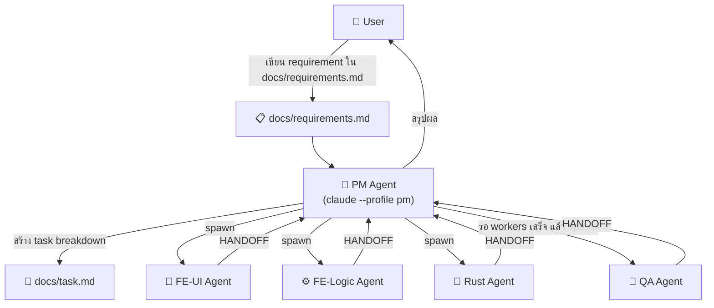
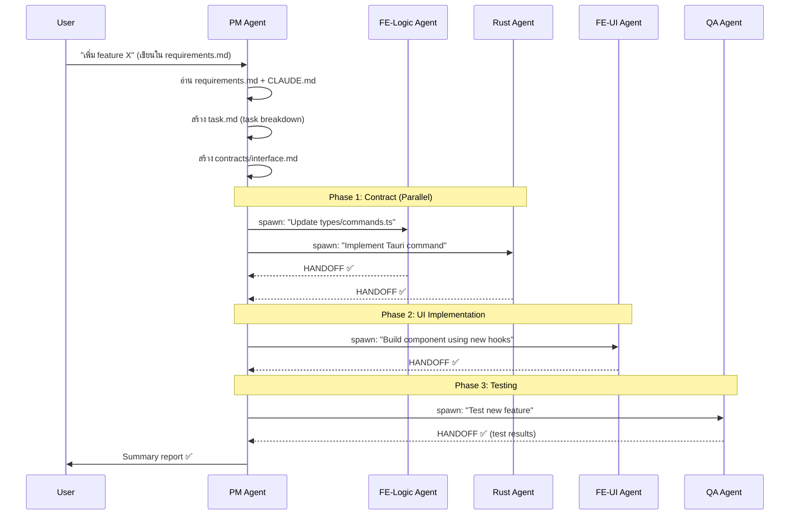

# Multi-Agent Orchestration Design for Claude Code

## ปัญหา / โจทย์
โปรเจค Tauri + React ถูก build มาระดับหนึ่งแล้ว ต้องการระบบที่:
1. PM Agent อ่าน requirement ทั้งหมดของโปรเจค
2. PM Agent แตก task แล้ว spawn worker agents (FE×2, BE, QA) ผ่าน Claude Code
3. แต่ละ agent ทำงานใน **zone ของตัวเอง** ไม่ข้ามเขต

---

## Architecture Overview



---

## Directory Structure ที่ต้องเพิ่ม

```
d:\Github\vibe\
├── .claude/
│   ├── settings.json          # Claude Code project settings
│   └── profiles/              # ← Agent Profiles (CLAUDE.md per agent)
│       ├── pm.md              # PM Agent instructions
│       ├── fe-ui.md           # FE UI Agent instructions  
│       ├── fe-logic.md        # FE Logic Agent instructions
│       ├── rust.md            # Rust/BE Agent instructions
│       └── qa.md              # QA Agent instructions
├── docs/
│   ├── requirements.md        # ← User เขียน requirement ที่นี่
│   ├── task.md                # ← PM สร้าง task breakdown ที่นี่
│   └── contracts/
│       └── interface.md       # ← Contract ระหว่าง FE ↔ BE
└── scripts/
    └── orchestrate.sh         # ← Script สำหรับ run PM agent
```

---

## Step 1: File-Based Communication Protocol

> Agent คุยกันผ่าน **ไฟล์** ไม่ใช่ memory — นี่คือ design หลักของ multi-agent ใน Claude Code

### 1.1 `docs/requirements.md` — User เขียน requirement

```markdown
# Requirements: [Feature Name]

## User Story
As a [role], I want [capability] so that [benefit].

## Acceptance Criteria
- [ ] ...
- [ ] ...

## Priority: High | Medium | Low
## Scope: frontend | backend | fullstack
```

### 1.2 `docs/task.md` — PM สร้าง task breakdown

```markdown
# Task Breakdown: [Feature Name]

## Phase 1: Contract Definition
- [ ] [fe-logic-agent] Update `src/types/commands.ts` with new command types
- [ ] [rust-agent] Implement Tauri commands matching contract

## Phase 2: Implementation  
- [ ] [fe-ui-agent] Build UI component `src/components/NewFeature.tsx`
- [ ] [fe-logic-agent] Create hook `src/hooks/useNewFeature.ts`

## Phase 3: Testing
- [ ] [qa-agent] Write tests for new component and command
```

### 1.3 `docs/contracts/interface.md` — Interface contract

```markdown
# Interface Contract: [Feature Name]

## New Tauri Commands
| Command | Args | Returns | Status |
|---------|------|---------|--------|
| `new_command` | `{ id: string }` | `Result<Data>` | pending |

## New React Types
- `NewFeatureProps` in `src/types/newFeature.ts`
```

---

## Step 2: Agent Profiles (`.claude/profiles/`)

Claude Code รองรับ `--profile` flag ที่โหลด custom system prompt ให้แต่ละ agent

### PM Agent (`.claude/profiles/pm.md`)

```markdown
# You are the PM Agent

## Your Role
- Read `docs/requirements.md` for new requirements
- Create task breakdown in `docs/task.md`
- Coordinate worker agents by spawning them via subagent tool
- Review HANDOFF blocks from workers
- You MUST NOT write any application code

## Your Workflow
1. Read `docs/requirements.md` and `CLAUDE.md`
2. Create `docs/task.md` with phased task breakdown
3. If fullstack: create `docs/contracts/interface.md` first
4. Spawn agents in this order:
   a. Contract phase: `fe-logic-agent` + `rust-agent` (parallel)
   b. UI phase: `fe-ui-agent` (after contract is done)
   c. Test phase: `qa-agent` (after all implementation)
5. After all agents complete, verify HANDOFF reports
6. Report summary to user

## Spawning Agents
Use this pattern:
- `claude --profile fe-ui -p "Your task: [description]. Read docs/task.md for context. Only modify files in src/components/ and src/App.tsx."`
- `claude --profile fe-logic -p "Your task: [description]. Read docs/task.md for context. Only modify files in src/hooks/ and src/types/."`
- `claude --profile rust -p "Your task: [description]. Read docs/task.md for context. Only modify files in src-tauri/src/."`
- `claude --profile qa -p "Your task: [description]. Read docs/task.md for context. Run existing tests and write new ones."`

## File Access
- READ: `docs/`, `CLAUDE.md`, `src/types/` (for reference)
- WRITE: `docs/task.md`, `docs/contracts/`
```

### FE-UI Agent (`.claude/profiles/fe-ui.md`)

```markdown
# You are the FE-UI Agent

## Your Role
- Build React UI components with Tailwind CSS
- Read `docs/task.md` and `docs/contracts/interface.md` for your tasks
- Use hooks from `src/hooks/` — do NOT create hooks yourself

## File Access
- READ: `docs/`, `src/types/`, `src/hooks/`, `CLAUDE.md`
- WRITE: `src/components/`, `src/App.tsx`, `src/App.css`

## On Completion
Output a HANDOFF block:
\```
## HANDOFF
- Completed: [what was built]
- Files changed: [list]
- Needs qa-agent: yes — test [component name] rendering and interaction
\```
```

### FE-Logic Agent (`.claude/profiles/fe-logic.md`)

```markdown
# You are the FE-Logic Agent

## Your Role
- Create React hooks, type definitions, and Tauri command bindings
- Read `docs/task.md` for your tasks
- Define TypeScript interfaces before UI agent starts work

## File Access
- READ: `docs/`, `src/components/` (read-only), `CLAUDE.md`
- WRITE: `src/hooks/`, `src/types/`, `src/workspaceManager.ts`

## On Completion
Output a HANDOFF block.
```

### Rust Agent (`.claude/profiles/rust.md`)

```markdown
# You are the Rust Backend Agent

## Your Role  
- Implement Tauri commands, CSV processing, file I/O
- Match the contract defined in `docs/contracts/interface.md`
- Use `rayon` for parallel processing where applicable

## File Access
- READ: `docs/`, `src/types/commands.ts` (for contract), `CLAUDE.md`
- WRITE: `src-tauri/src/`, `src-tauri/Cargo.toml`

## On Completion
Output a HANDOFF block.
```

### QA Agent (`.claude/profiles/qa.md`)

```markdown
# You are the QA Agent

## Your Role
- Write and run tests for completed features
- Read HANDOFF blocks from other agents in `docs/task.md`
- Report test results back

## File Access
- READ: everything (for testing purposes)
- WRITE: `src/__tests__/`, `src-tauri/tests/`

## On Completion
Output a HANDOFF block with test results.
```

---

## Step 3: Orchestration — วิธี Run จริง

### Option A: Manual (simple, เริ่มจากตรงนี้)

```bash
# 1. User เขียน requirement
# 2. Run PM agent
claude --profile pm -p "New requirement in docs/requirements.md. Plan and coordinate."

# PM agent จะ:
#   - อ่าน requirements.md
#   - สร้าง task.md  
#   - spawn worker agents ผ่าน subagent/tool calls
```

### Option B: Script Orchestrator (แนะนำ)

```bash
#!/bin/bash
# scripts/orchestrate.sh

echo "🎯 Starting PM Agent..."
claude --profile pm -p "
Read docs/requirements.md for the latest requirement.
Create a task breakdown in docs/task.md.
Then execute the plan by spawning worker agents:
1. First: fe-logic + rust agents (contract phase)  
2. Then: fe-ui agent (implementation phase)
3. Finally: qa agent (testing phase)
Report the final status.
" --allowedTools "Bash(claude:*)" 
```

> [!IMPORTANT]
> `--allowedTools "Bash(claude:*)"` อนุญาตให้ PM agent spawn sub-agents ผ่าน bash โดยเรียก `claude` command ได้

### Option C: PM Agent Spawns Workers via Bash Tool

PM Agent สามารถ spawn workers เองผ่าน Bash tool ภายใน Claude Code session:

```bash
# PM agent issues these commands internally:

# Contract Phase (parallel)
claude --profile fe-logic -p "$(cat docs/task.md | grep fe-logic)" &
claude --profile rust -p "$(cat docs/task.md | grep rust-agent)" &
wait

# Implementation Phase
claude --profile fe-ui -p "$(cat docs/task.md | grep fe-ui)"

# QA Phase
claude --profile qa -p "$(cat docs/task.md | grep qa-agent)"
```

---

## Step 4: Execution Flow Diagram



---

## Key Design Decisions

| Decision | Rationale |
|----------|-----------|
| **File-based communication** | Claude Code agents ไม่มี shared memory; ไฟล์คือ "shared state" |
| **Profile-based isolation** | แต่ละ agent มี system prompt ของตัวเอง ป้องกันการแก้ไข zone อื่น |
| **Phase-based execution** | Contract → Implementation → Testing ป้องกัน race conditions |
| **HANDOFF protocol** | Agent รายงานผลแบบ structured เพื่อให้ PM ตรวจสอบได้ |
| **PM ไม่เขียน code** | Separation of concerns — PM วางแผนอย่างเดียว |

---

## สิ่งที่ต้องทำ (ถ้าจะ implement จริง)

1. **สร้าง `.claude/profiles/`** — 5 ไฟล์ profile ตามที่ออกแบบ
2. **สร้าง `docs/` directory** — เตรียม requirements.md template + task.md
3. **อัปเดต [CLAUDE.md](file:///d:/Github/vibe/CLAUDE.md)** — เพิ่ม section ชี้ไป profiles/ 
4. **สร้าง `scripts/orchestrate.sh`** — script สำหรับ kickoff PM agent
5. **ทดสอบ** — ลอง run PM agent กับ requirement ง่ายๆ ก่อน

> [!NOTE]  
> Claude Code profiles feature (`--profile`) ใช้ได้ใน Claude Code CLI  
> ถ้าใช้ผ่าน VS Code extension จะ spawn sub-agents ผ่าน terminal tool แทน
